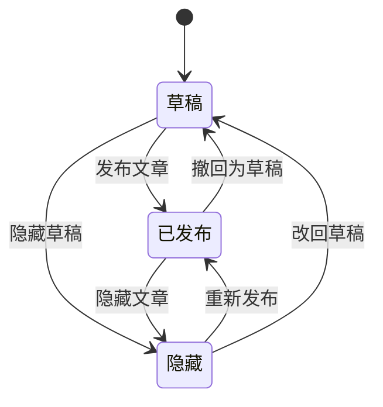
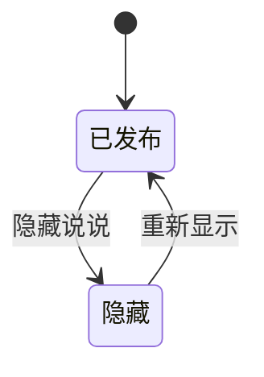
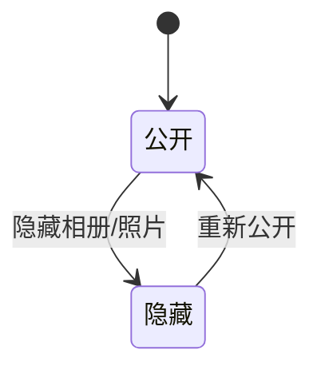
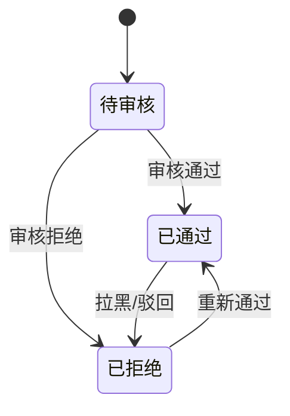
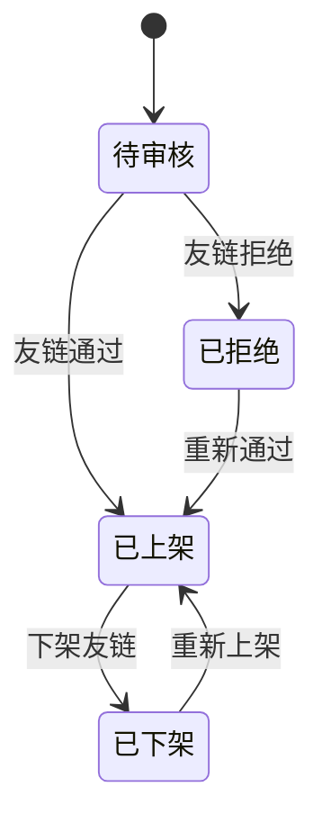

# 04-业务规则与状态流转

## 状态流转图

### 文章

### 说说

### 相册和照片

### 评论和留言

### 友链

## 文章规则

- 文章标题必填。
- 文章正文必填。
- 草稿允许没有封面。
- 发布文章时必须有标题和正文。
- 发布文章时自动写入发布时间。
- 已发布文章可以改为隐藏。
- 隐藏文章前台不可见，后台可见。
- 置顶文章在首页和文章列表优先展示。
- 推荐文章进入首页推荐区域。
- 删除文章时同步删除文章和标签的关联关系。
- 删除文章时同步删除文章评论。
- 批量删除文章时，每篇文章都必须执行和单篇删除相同的关联清理规则。
- 分类不存在时不能保存文章。
- 标签不存在时可以先创建标签，再关联文章。
- 阅读量只能增加，不允许后台随意改小。

## 说说规则

- 说说内容必填。
- 说说可以带多张图片。
- 说说允许没有图片。
- 隐藏说说后前台不可见，后台可见。
- 删除说说时同步删除说说图片记录。
- 删除说说时同步删除说说评论。
- 批量删除说说时，每条说说都必须同步清理图片记录和评论。
- 置顶说说优先展示。
- 说说不强制分类。

## 相册规则

- 相册名称必填。
- 相册可以没有照片。
- 相册封面可手动设置。
- 如果没有手动设置封面，默认取第一张公开照片作为封面。
- 隐藏相册后，前台不显示整个相册。
- 隐藏照片后，前台不显示该照片。
- 删除相册时同步删除相册下照片记录。
- 批量删除照片时只删除照片记录，不处理真实图片资源。
- 照片排序越小越靠前。
- 相册排序越小越靠前。

## 分类规则

- 分类名称必填。
- 分类名称不能重复。
- 分类下存在文章时，不允许删除分类。
- 分类隐藏后，前台不显示该分类入口。
- 分类隐藏不影响文章本身是否可访问。
- 分类排序越小越靠前。

## 标签规则

- 标签名称必填。
- 标签名称不能重复。
- 标签被文章使用时，不允许直接删除。
- 删除标签前需要先解除文章关联。
- 同一篇文章不能重复关联同一个标签。

## 评论规则

- 评论内容必填。
- 评论必须属于文章或说说其中一种。
- 评论不能同时属于文章和说说。
- 新评论默认待审核。
- 只有已通过评论前台可见。
- 已拒绝评论前台不可见，后台可见。
- 管理员可以回复评论。
- 删除评论后，同步减少文章或说说的评论数。
- 批量删除评论后，也必须按被删除评论所属内容同步减少评论数。
- 回复评论不改变评论审核状态。
- 评论邮箱可空，但如果填写必须是合法邮箱格式。

## 留言规则

- 留言内容必填。
- 留言昵称必填。
- 新留言默认待审核。
- 只有已通过留言前台可见。
- 管理员可以回复留言。
- 已拒绝留言前台不可见，后台可见。
- 删除留言只删除留言本身，不影响其他模块。
- 批量删除留言只删除留言本身，不影响其他模块。

## 友链规则

- 友链网站名称必填。
- 友链网站地址必填。
- 友链地址不能重复。
- 新友链申请默认待审核。
- 已上架友链前台可见。
- 已下架友链前台不可见，后台可见。
- 已拒绝友链前台不可见，后台可见。
- 友链排序越小越靠前。
- 批量删除友链只删除友链记录本身。

## 站点配置规则

- 站点配置只能有一条。
- 站点名称必填。
- 修改站点配置只做正常业务更新，不写入操作日志表。
- 关于我内容允许为空。
- 备案号允许为空。
- 社交链接允许为空。
- 首页公告为空时前台不显示公告区域。

## 认证规则

- 不提供管理员注册接口，管理员数据手动入库。
- 登录成功后返回 JWT。
- 登录失败不返回具体是用户名错还是密码错。
- 密码必须加密存储。
- 管理员表必须有 `password_version` 字段，用于修改密码后让旧 Token 失效。
- 修改密码后，旧 Token 后续应失效。
- 除登录外，后台接口都需要 JWT。
- Token 过期后前端需要重新登录。

## 文章 AOP 学习规则

- 第一版不做操作日志入库，不提供操作日志查询接口。
- 文章模块可以使用 Spring AOP 学习横切能力。
- 文章新增、修改、删除、发布、隐藏等关键动作可以通过 AOP 输出控制台行为日志。
- 文章详情和文章分页查询可以通过 AOP 输出耗时日志。
- AOP 只做日志输出和耗时统计，不改变接口返回结果。
- AOP 捕获异常后必须继续抛出，由全局异常处理统一返回。
- 事务回滚时不能把业务动作误记为成功。
